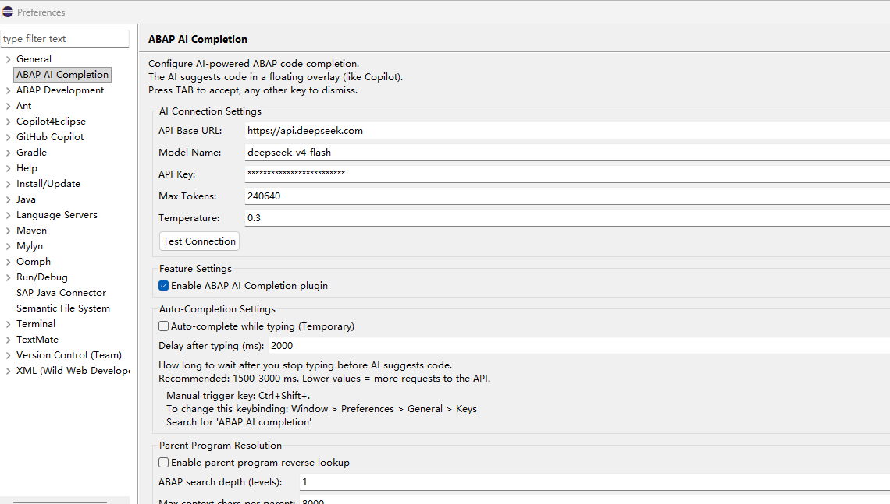
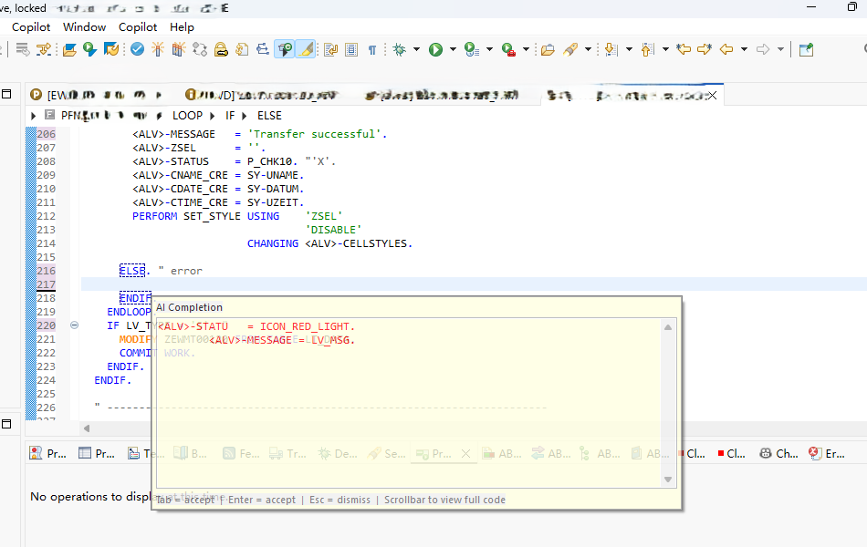
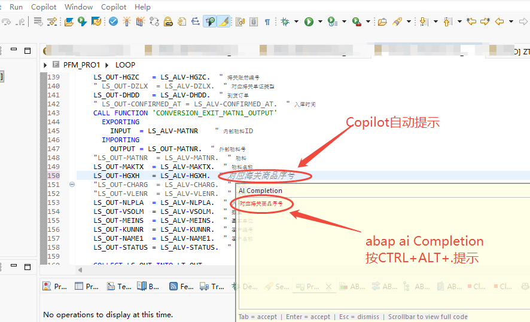

# ABAP AI Completion - Eclipse Plugin

> 🌐 **Language / 语言**: [English](README.md) | [中文](README_CN.md)



---

## English

An AI-powered code completion plugin for SAP ABAP developers, built for Eclipse. Based on Large Language Models (LLM), it supports local LLMs for in-house/enterprise use, preventing corporate code from being uploaded to the Internet to guarantee code confidentiality, and provides intelligent code suggestions and auto-completion while writing ABAP code.

### Advantages over Copilot
- **✅ Local LLM support**: A local LLM can be used for in-house/enterprise use, preventing corporate code from being uploaded to the Internet to guarantee code confidentiality.
- **✅ Fully open source, free for enterprise use**: This plugin is completely open source and free for enterprise use, with no fees required, and you can use it with peace of mind.
- **🤖 Full workspace context**: Besides the current editor's ABAP code, you can optionally pass in all ABAP code currently open in the workspace. Copilot only supports the current editor's code and does not offer this feature.
- **⌨️ Deep search for related code references**: Searches related programs and sends them to the AI as code references for completion. Note that deeper search levels affect performance; a maximum of one level is recommended.
- **🎯 Local SKILL as code reference**: Define custom functions or templates in SKILL files and pass them as reference for more reasonable AI completions. Copilot also has configurable SKILLs, but they are only used for chat, not for AI reference code completion.

### Features
- **🤖 AI smart completion**: Provides context-aware ABAP code suggestions based on the AI model at the cursor position
- **⌨️ Manual trigger**: Press `Ctrl+Shift+.` to manually invoke AI code completion
- **⚡ Auto-completion**: Optional auto-completion mode that triggers AI suggestions after you stop typing
- **📋 INCLUDE resolution**: Automatically resolves ABAP INCLUDE programs for more accurate contextual completion
- **🎯 Skill directory**: Supports `.abap`, `.txt`, `.skill` files as AI reference patterns
- **🌊 Floating overlay**: Code suggestions display in a floating overlay (Copilot-style)
- **🎨 Custom styling**: Customize the display colors of completion code
- **🔌 Flexible configuration**: Supports any service endpoint compatible with the OpenAI Chat Completions API
- ** Manual completion (`Ctrl+Shift+.`) uses SKILL**: Auto-completion (`requestQuickCompletion`) uses a simplified standalone prompt and does not load SKILL directory content.
- ** Completion mode configuration**: In preferences you can choose whether manual completion shows as an overlay or inserts directly; both use SKILL content.

---

### Installation (End Users)

#### System Requirements

- **Eclipse**: 4.7+ (Neon) or later
- **Java**: JDK 17 or later
- **Network**: Access to the configured AI API service

#### Installation Methods

There are three ways to install; Method 1 (Eclipse Marketplace) is recommended.

##### Method 1: Install from the Eclipse Marketplace (recommended)

1. In the Eclipse menu bar, open `Help` → `Eclipse Marketplace...`

2. Type **`ABAP AI`** in the search box and find **`ABAP AI Completion`**

3. Click `Install` and follow the prompts (accept the license, trust the certificate)

4. After installation, click `Restart Now (Restart Eclipse)` to load the plugin

##### Method 2: Install via Install New Software

1. In the Eclipse menu bar, select `Help` → `Install New Software...` (some versions show `Help` → `Install Software...`)

2. Click the `Add...` button in the `Available Software` dialog and enter the update site URL:

   ```
   Name: ABAP AI Completion
   Location: https://yan252.github.io/ABAP-AI-completion/update-site
   ```

   > 💡 You can also click `Archive...` and select `ABAP-AI-Completion-UpdateSite-1.0.5.zip` for offline installation.

3. Check `ABAP AI Completion Feature`, then click `Next` → `Next` → accept the license → `Finish`

4. After installation, click `Restart Now (Restart Eclipse)` to load the plugin

##### Method 3: Use the `dropins` approach (debugging/development)

Copy `dist/com.sap.abap.ai.completion_1.0.5.jar` to Eclipse's `<install-path>/dropins/` directory (create it if it does not exist), then restart Eclipse.

---

### Usage

#### Manual Code Completion

1. Open any ABAP source file (`.abap`, `.prog`, etc.)
2. Place the cursor where you want completion
3. Press `Ctrl + Shift + .` to invoke AI completion
4. The AI suggestion displays as a floating overlay
5. Press `Tab` to accept the suggestion, or any other key to cancel

#### Auto-Completion Mode

After enabling **"Auto-complete while typing"** in the configuration, AI suggestions automatically trigger after you stop typing for a period (default 2000ms).

#### Changing the Shortcut

To change the shortcut:
1. Menu: `Window` → `Preferences`
2. Navigate to: `General` → `Keys`
3. Search: `ABAP AI completion`
4. Click the `Binding` field and press the new key combination
5. Click `OK` to save

---

### Configuration

#### Opening the Configuration Page

1. Menu: `Window` → `Preferences`
2. Find **`ABAP AI Completion`** in the left navigation tree
3. The configuration page is shown below:


#### Configuration Items

##### AI Connection Settings

| Setting | Description | Example |
|---------|-------------|---------|
| **API Base URL** | AI service endpoint URL | `https://api.openai.com/v1` |
| **Model Name** | AI model name to use | `gpt-4`, `deepseek-v4-flash` |
| **API Key** | API authentication key | (displayed as stars) |
| **Max Tokens** | Maximum number of generated tokens | `256` |
| **Temperature** | Creativity temperature (0.0-2.0) | `0.3` (lower means more deterministic output) |

> 💡 **Tip**: Click the `Test Connection` button to verify the API connection.

##### Feature Settings

| Setting | Description |
|---------|-------------|
| **Enable ABAP AI Completion plugin** | Enable/disable the entire plugin |
| **Auto-complete while typing** | When enabled, auto-triggers AI suggestions after you stop typing |

##### Auto-Completion Settings

| Setting | Description |
|---------|-------------|
| **Delay after typing (ms)** | How many milliseconds after you stop typing before auto-completion triggers |

> 💡 **Suggestion**: Recommended value is 1500-3000 ms. Lower values increase API request frequency.

##### Skill Directory

Place `.abap`, `.txt`, or `.skill` files in the skill directory and the AI references these file code patterns for completion. This is very useful for project-specific coding standards and naming conventions.

##### Custom System Prompt

Customize the system prompt sent to the AI to guide it to follow specific code styles and standards.

##### Overlay Style

Customize the display colors of AI completion code in the editor.

---

### Developer Guide (Custom Development)

#### Environment Requirements

- **JDK**: 17+
- **Eclipse**: Eclipse with Plug-in Development Environment (PDE)
- **Build Tool**: Apache Maven (optional)

#### Importing the Project

1. Clone the repository locally:
   ```bash
   git clone https://github.com/yan252/ABAP-AI-completion.git
   ```

2. Import the project into Eclipse:
   - `File` → `Import` → `Existing Projects into Workspace`
   - Select the cloned project directory
   - Check the project and click `Finish`

#### Project Structure

```
com.sap.abap.ai.completion/
├── META-INF/
│   └── MANIFEST.MF              # OSGi bundle manifest
├── src/
│   └── com/sap/abap/ai/completion/
│       ├── client/              # AI API client
│       │   ├── AIClient.java
│       │   ├── AIClientException.java
│       │   └── PromptCacheManager.java    # Prompt compression & multi-node cache management
│       ├── editor/              # Editor integration
│       │   ├── AICompletionHandler.java
│       │   ├── AICompletionListener.java
│       │   ├── AICompletionOverlay.java
│       │   ├── AICompletionProposalPopup.java
│       │   ├── AICompletionService.java
│       │   └── AIOverlayManager.java
│       ├── logging/             # Logging
│       │   └── AILogger.java
│       ├── parser/              # ABAP parser
│       │   ├── AbapCodeTruncator.java
│       │   ├── AbapIncludeResolver.java
│       │   ├── AbapLanguageDetector.java
│       │   ├── ParentProgramContext.java
│       │   ├── ParentProgramResolver.java
│       │   └── WorkspaceCodeCollector.java
│       ├── preferences/         # Configuration management
│       │   ├── AICompletionPreferencePage.java
│       │   ├── AIConfiguration.java
│       │   ├── PreferenceConstants.java
│       │   └── PreferenceInitializer.java
│       ├── ui/                  # UI integration such as status bar
│       │   └── AbapAIStatusLineContribution.java
│       └── Activator.java       # Bundle activator
├── icons/
│   └── SAPLogo.ico              # Plugin icon
├── dist/                        # Published JAR
│   └── com.sap.abap.ai.completion_1.0.1.jar
├── update-site/                 # Update site
│   ├── features/
│   ├── plugins/
│   ├── artifacts.jar / artifacts.xml
│   ├── content.jar / content.xml
│   └── site.xml
├── tools/
│   └── CacheVerifyTool.java     # Cache verification tool
├── plugin.xml                   # Plugin extension point declarations
├── build.properties             # Build properties
├── build.ps1                    # Windows build script
├── build_plugin.xml             # Build script (ANT)
├── generate-update-site.ps1     # Update site generation script
└── rebuild.ps1                  # Rebuild script
```

#### Key Extension Points

This plugin integrates through the following Eclipse extension points:

| Extension Point | Purpose |
|-----------------|---------|
| `org.eclipse.ui.startup` | Plugin auto-start |
| `org.eclipse.ui.preferencePages` | Configuration page registration |
| `org.eclipse.core.runtime.preferences` | Preference initialization |
| `org.eclipse.ui.commands` | Completion command definition |
| `org.eclipse.ui.bindings` | Shortcut key bindings |

#### Core Architecture

1. **AIClient**: Pure Java HTTP client that calls the AI Chat Completions API, no external JSON library required
2. **AICompletionService**: Async completion service that handles timeouts, cancellation, and errors
3. **AbapIncludeResolver**: Resolves ABAP INCLUDE programs to provide full context to the AI
4. **AIOverlayManager**: Manages the display and interaction of the floating overlay
5. **AIConfiguration**: Unified configuration management with preference storage

#### MESSAGE Nodes Sent to AI

When manual completion (`Ctrl+Shift+.`) is triggered, the plugin constructs a message list of **1 `system` node + 6 `user` nodes** to send to the AI (corresponding to the `buildUserMessages` method in [AICompletionService.java](src/com/sap/abap/ai/completion/editor/AICompletionService.java)). The meaning of each node is as follows:

| Node | Role | Content |
|------|------|---------|
| **System** | `system` | System prompt. Defines the AI's role (senior SAP ABAP development expert), completion rules, and output constraints. Can be overridden using `Custom System Prompt` |
| **Node 1/6** | `user` | **SKILL file content**: `.abap`/`.txt`/`.skill` files loaded from the skill directory as code style and best-practice references. If no SKILL, it states "use system default ABAP coding standards" |
| **Node 2/6** | `user` | **Parent program call context**: When the current file is an INCLUDE, deep search finds the code of the parent programs that call it (recursively searched by configured search depth). Compressed via `PromptCacheManager.compressAbapContext` |
| **Node 3/6** | `user` | **Programs open in workspace**: Other ABAP files open in the current Eclipse workspace as style reference and supplementary context (collected by `WorkspaceCodeCollector`, also compressed) |
| **Node 4/6** | `user` | **Current program**: Complete code of the program at the cursor position (with all INCLUDEs expanded via `AbapIncludeResolver`), with filename and code type labeled |
| **Node 5/6** | `user` | **Program metadata**: Summary of filename, code type, INCLUDE count, parent program/workspace/SKILL load status to help the AI comprehensively understand the overall context |
| **Node 6/6** | `user` | **Cursor position context**: The cursor's line and column number, plus the 15 lines before and 5 lines after the cursor, with the insertion position marked with `[[[CURSOR_HERE]]]` — this is exactly where the AI generates the completion content |

> **Note**: Nodes 2 and 3 are uniformly compressed before sending based on the `Max Context Chars (getMaxContextChars)` threshold to avoid context window overflow; the other nodes are sent as-is according to their own rules. If a node has no matching content, a placeholder message (stating that node's current status) is still sent to ensure the AI always receives the complete 1+6 node structure.

> **Comparison**: Auto-completion (`requestQuickCompletion`) does not load SKILL or the above context; it uses a simplified standalone prompt and only sends 1 `system` node + 1 `user` node (current line context).

#### Building the Plugin

##### Using Eclipse Export

1. Right-click the project → `Export`
2. Select `Deployable plug-ins and fragments`
3. Choose the output directory as `dist/`
4. Click `Finish`

##### Using ANT Script

```bash
# Windows PowerShell
.\build.ps1
```

Or use the provided `build_plugin.xml`:
```bash
ant -f build_plugin.xml
```

#### Debugging the Plugin

Launch a new Eclipse instance in Eclipse to debug:

1. `Run` → `Run Configurations`
2. Create a new `Eclipse Application` configuration
3. In the `Plug-ins` tab, ensure `com.sap.abap.ai.completion` is included
4. Click `Run` to start

---

### FAQ

#### Q: The configuration option does not appear after installing the plugin?

**A:** Please verify:
1. The JAR file is correctly placed in the `dropins` directory
2. Eclipse has been restarted
3. The Eclipse version meets the requirement (4.7+)
4. The Java version is 17 or later

#### Q: What if code completion requests time out?

**A:**
- Check the network connection
- Verify the API Base URL and API Key are configured correctly
- You can increase `Max Tokens` and `Temperature` values in the configuration
- Try clicking the `Test Connection` button to verify the connection

#### Q: Which AI services are supported?

**A:** Any service compatible with the OpenAI Chat Completions API, including but not limited to:
- OpenAI (GPT-4, GPT-3.5, etc.)
- Azure OpenAI Service
- Alibaba Cloud Bailian (DashScope)
- Any compatible third-party API service

#### Q: Can it be used offline?

**A:** No. This plugin requires a network connection to call the AI API service. However, reference files in the skill directory can help the AI generate code that better conforms to project standards.

#### Q: Is the API Key secure?

**A:** The API Key is stored in Eclipse preferences and displayed as stars. However, note that:
- Do not commit configuration files containing API Keys to version control
- Use environment variables or a key-management service to store keys (if possible)

---

### Technology Stack

- **Language**: Java 17
- **Framework**: Eclipse Platform / JFace / SWT
- **API Protocol**: OpenAI Chat Completions API
- **JSON Handling**: Pure Java implementation (no third-party dependencies)
- **Build**: Eclipse PDE / ANT

---

### License

This project is for learning and personal use only. Please comply with the terms of service and licensing requirements of the AI services you use.

---

### Acknowledgments

This plugin is inspired by AI-assisted programming tools such as VS Code Copilot, aiming to provide a better coding experience for SAP ABAP developers.
